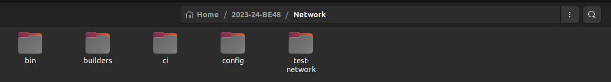

# Table of Contents
- [Table of Contents](#table-of-contents)
- [Introduction](#introduction)
- [Requirements and Installation](#requirements-and-installation)
  - [OS](#os)
  - [Node.js](#nodejs)
  - [Git](#git)
  - [Docker](#docker)
  - [Clone Project Repository](#clone-project-repository)
  - [Hyperledger Fabric](#hyperledger-fabric)
  - [IPFS (Interplanetary File System)](#ipfs-interplanetary-file-system)
  - [MongoDB](#mongodb)
- [Architecture](#architecture)
- [Setting up the Project (Deploying Locally)](#setting-up-the-project-deploying-locally)
  - [One PC Setup](#one-pc-setup)
    - [IPFS Configuration](#ipfs-configuration)
    - [MongoDB Configuration](#mongodb-configuration)
    - [Hyperledger Fabric Configuration](#hyperledger-fabric-configuration)
  - [Two PC Setup](#two-pc-setup)
    - [IPFS Configuration](#ipfs-configuration-1)
    - [MongoDB Configuration](#mongodb-configuration-1)
    - [Hyperledger Fabric](#hyperledger-fabric-1)
- [Setting up the Project (Deploying on College Servers)](#setting-up-the-project-deploying-on-college-servers)
- [Starting the Project](#starting-the-project)
  - [Starting the MongoDB Service](#starting-the-mongodb-service)
  - [Starting the IPFS Service](#starting-the-ipfs-service)
  - [Starting the Network](#starting-the-network)
  - [Starting the Backend Server for `org1`](#starting-the-backend-server-for-org1)
  - [Starting the Backend Server for `org2`](#starting-the-backend-server-for-org2)
- [Using the Chat Application](#using-the-chat-application)
  - [Login / Register](#login--register)
  - [Create New Group](#create-new-group)
  - [Join Existing Group](#join-existing-group)
  - [Notifications](#notifications)
  - [Chat Room](#chat-room)
  - [Logout](#logout)
- [Stopping the Network and Servers](#stopping-the-network-and-servers)
- [Issues](#issues)
- [Contact Details](#contact-details)

<div style="page-break-before: always;"></div>

# Introduction

Aatmanirabhar Sanchar chat application aims to remove the need of central servers for communication without sacrificing safety and security. This is achieved by using a private blockchain framework Hyperledger Fabric. This chat application aims to achieves secure communication of text and other types of media (mp3, mp4, zip, etc) without using any third-party software like AWS.

<div style="page-break-before: always;"></div>

# Requirements and Installation

## OS
**Version Used: Ubuntu 22.04.4 LTS (Flexible)**

**Lab PC with IP: 192.168.32.70** (hpc4)

Installation of Ubuntu 22.04.4 LTS can be done by following the steps mentioned in the [official documentation](https://ubuntu.com/download/desktop).


## Node.js
**Version Used: v16.20.2 (Required)**

The current frontend depends on this version of node.js. New versions of node have some changes in webkit which breaks the current version of frontend. So, if you wish to updgrade node you will have to update the frontend accordingly. Installation of Node.js can be done by following the steps mentioned below.

```bash
# installs NVM (Node Version Manager)
curl -o- https://raw.githubusercontent.com/nvm-sh/nvm/v0.39.7/install.sh | bash

# download and install Node.js
nvm install 16

node -v # should print `v16.20.2`
npm -v # should print `v8.19.4`
```


## Git
**Version Used: 2.34.1 (Flexible)**

Installation of Git can be done by following the steps mentioned in the [official documentation](https://git-scm.com/book/en/v2/Getting-Started-Installing-Git).


## Docker
**Version Used: 26.0.1 (Flexible)**

Installation of Docker can be done by following the steps mentioned in the [official documentation](https://docs.docker.com/engine/install/ubuntu/).

> Makes sure to also follow the [post-installation steps](https://docs.docker.com/engine/install/linux-postinstall/).


## Clone Project Repository

```bash
git clone https://github.com/VESIT-CMPN-Projects/2023-24-BE48
```
Or download the zip file.


## Hyperledger Fabric
**Version Used: `latest`**

We need to install two things for Hyperledger Fabric:
1. Hyperledger Fabric binaries
2. Hyperledger Fabric docker images

To do this Hyperledger Fabric provides us with a installation script.

```bash
cd 2023-24-BE48

curl -sSLO https://raw.githubusercontent.com/hyperledger/fabric/main/scripts/install-fabric.sh && chmod +x install-fabric.sh

./install-fabric.sh d b
```

This will install the latest version of Hyperledger Fabric binaries and docker images.

To check the docker images installed, run the following command:

```bash
docker images
```
The output should be similar to this:

****
The binaries and other files will be installed in three directories:
`bin`, `builders` and `config`. If you look into the `Network` directory you will find these three directories already there. Make sure to replace these directories with the new ones that are in the root directory of the project.

```bash
# Assuming you are in the root directory of the project i.e. 2023-24-BE48
cp -r bin builders config Network/
```



The installation of Hyperledger Fabric is now complete.


## IPFS (Interplanetary File System)

IPFS will handle all the file transfers in the chat application. To install IPFS, follow the steps mentioned below.

Go here for latest version or follow the steps below - [IPFS Kubo](https://docs.ipfs.tech/install/command-line/#install-official-binary-distributions)


```bash
# From Home Directory
# Download the IPFS tar file
wget https://dist.ipfs.tech/kubo/v0.28.0/kubo_v0.28.0_linux-amd64.tar.gz

# Extract the tar file
tar -xvzf kubo_v0.28.0_linux-amd64.tar.gz

cd kubo

# Move the IPFS binary to /usr/local/bin
sudo bash install.sh

# Check if IPFS is installed
ipfs --version

# Initialize IPFS
ipfs init
```

Remove Bootstrap nodes
```bash
# From Home directory move to .ipfs directory
cd .ipfs

# Edit configuration file for IPFS
nano config
```

Make sure to remove all the addresses in the `Bootstrap` list.

Now, save the file using `Ctrl + S` and `Ctrl + X`.

This step is necessary otherwise we fall into some CORS Issue
```bash
ipfs config --json API.HTTPHeaders.Access-Control-Allow-Origin "[\"*\"]"
ipfs config --json API.HTTPHeaders.Access-Control-Allow-Credentials "[\"true\"]"
```

To start ipfs we need to start the daemon.
```bash
ipfs daemon
```
However, this takes up an entire terminal window. To run it in the background, we will create a systemd service. `CTRL + C` to stop the daemon.

```bash
# Create a systemd service
sudo nano /etc/systemd/system/ipfs-node.service
```

Add the following content to the file:
```bash
[Unit]
Description=IPFS Node
After=network.target

[Service]
ExecStart=/usr/local/bin/ipfs daemon
ExecReload=/usr/local/bin/ipfs daemon
Restart=on-failure
User=ubuntu # Change this to your username
Group=ubuntu # Change this to your group

[Install]
WantedBy=default.target
```

> Make sure to change the `User` and `Group` to your username and group.
> 
> Hence, in my case, the username and group are `krish`. For the lab PC the username and group are `hpc4`.

Now, save the file using `Ctrl + S` and `Ctrl + X`.

Once, the file is saved, we need to reload the systemd daemon and start the IPFS service.

```bash
# Reload the systemd daemon
sudo systemctl daemon-reload

sudo systemctl start ipfs-node

# Check the status of the service
sudo systemctl status ipfs-node
```

If the service is running, you should see the following output:


For now we will stop the service. Run the following command:
```bash
sudo systemctl stop ipfs-node
```

The installation of IPFS is now complete.
For deeper understanding refer this [video](https://www.youtube.com/watch?v=QSZMN-UgSbo).


## MongoDB
**Version Used: v7.0.8 (Flexible)**

Installation of MongoDB can be done by following the steps mentioned in the [official documentation](https://docs.mongodb.com/manual/tutorial/install-mongodb-on-ubuntu/).

> Make sure to follow all steps until `Uninstall MongoDB Community Edition`. (Make sure systemd service called `mongod` is created. Start it and check status similar to IPFS service. Then stop it.)

**All the requirements have now been satisfied.**

<div style="page-break-before: always;"></div>

# Architecture


The components of the chat application are as follows:

- Org1
  - peer0
  - node server
  - ipfs node
  - orderer
  - CA
- Org2
  - peer0
  - node server
  - ipfs node
  - CA
  
As you can see, we need different ports for each of the services. The reason why we need different ports is because we are running multiple services on the same machine. Ideally, we would have different machines for each of the Organisation. So in that case the ports don't matter as they wont overlap anyway. However, for the sake of simplicity, we are running all the services on the same machine and hence, need to make sure the ports don't overlap.

<div style="page-break-before: always;"></div>

# Setting up the Project (Deploying Locally)

## One PC Setup

### IPFS Configuration

Since, both orgs will be running on the same PC we will use the same `ipfs` service between them both. So, no configuration is needed here.

### MongoDB Configuration

Since, both orgs will be running on the same PC we will use the same `mongod` service between them both. So, no configuration is needed here.

### Hyperledger Fabric Configuration

In this case, both the orgs are running on the same machine. So all the components mentioned above in [Architecture](#architecture) will be running on the same machine.

>This is not ideal as in the real world the each organization will have different machines. However, the current dockerfiles provided by Hyperledger Fabric have all components running on the same machine. So when we start the network using the start script, all the components will be started on the same machine.

This is how the project directory should look like initially:
(If you have **not** followed the above steps you will not have the `intall-fabric.sh` script, rest all the directories should be there.)


Now, first we need to create a **copy** of the `backend` and `frontend` folder and paste it in the root directory of the project. The reason for this is that we have two different peer nodes (one for each Org) and both these peer nodes have their own API endpoints running on different ports.  
Hence, we need to have two different backend folders, one for each peer node. And then we need two frontend folders for the two backend servers.  
Then **rename** the folders as `org2_backend` and `org2_frontend`.  

>If you rename them to something else make sure to change the `.gitignore` file accordingly or else the folders will be pushed to the git repository.

After renaming the folders, the project directory should look like this:


Once the above steps have been completed, if you navigate to the `backend` folder you will see a `.env` file (Select Show Hidden Files) with contents as shown below.


Now, in the .env file of the `org2_backend` folder that we just created we need to change two fields:
1. The **PORT** to `4445`. (Or any other unused port)
2. The **ORG_USER_ID** to `org2`. (Has to be named as org2)

Similarly, the .env file of the `frontend` folder looks like this:


> For React, the environment variables need to start with `REACT_APP`.

In the .env file of any frontend folder (in our project), the API_ADDRESS is the IP_ADDRESS and the API_PORT is the PORT of the **corresponding backend folder.**

So, for `org2_frontend` we need to change the API_PORT to `4445`. (Or any other port as long as it matched the PORT)

## Two PC Setup

> This is yet to be implemented. However, some of the things we found regarding this are mentioned below.

### IPFS Configuration

To use IPFS between many PCs they provide us with `ipfs-cluster`.  
**Docs:** https://ipfscluster.io/documentation/  
**Video Reference:** https://www.youtube.com/watch?v=yLz6ZU-CXmU

### MongoDB Configuration

To use MongoDB among multiple PCs we need something like [MongoDB Atlas](https://www.mongodb.com/products/platform/atlas-database). However, this is a 3rd party cloud which violates the requirement of our project where we can't use any 3rd party service.

To tackle this we came up with the idea of using Hyperledger Fabric itself as the database for storing user, group, etc. information. This approach can be found in our research paper but has **not** been implemented yet.

**Research Paper:** [Aatmanirbhar Sanchar - Chat Application](https://github.com/VESIT-CMPN-Projects/2023-24-BE48/blob/main/48-AI%2C%20Deep%20Learning%20%26%20DWH%20Mining-Richard%20Joseph_Yugchhaya%20Galphat.pdf)

### Hyperledger Fabric

All of the configuration of the `test-network` is done by the docker-compose files present in the `Network` folder. Hence, to install Fabric on two different PCs and have these services communicate with each other we need to change the contents of the docker-compose files.

Till Fabric version `1.x` all of the configuration was present in one docker file and hence, it was easy to configure. One of the approaches we found are:

https://techelix.medium.com/hyperledger-fabric-on-multiple-hosts-a33b08ef24f

However, this approach only works for Fabric version `1.x`. And with the added layer of Docker swarm the app became quite slow in comparision to the versions `2.x`.

Heres a course that teaches how to deploy Fabric `2.x` on multiple hosts but we couldn't get around it in time:

https://www.udemy.com/course/hyperledger-fabric-2x-multi-host-deployment/

<div style="page-break-before: always;"></div>

# Setting up the Project (Deploying on College Servers)

We were appointed two servers:

```
SERVER 1

LAN: 192.168.32.70:3478  
WAN: 115.242.70.53:3478

SERVER 2

LAN: 192.168.32.71:3479  
WAN: 115.242.70.53:3479
```

> All the steps below should be done on the TIFR Lab PC that has IP address `192.168.32.70`.
> Also, since we haven't completed Two PC Setup we won't be using Server 2.


Open the `.env` file in the `backend` folder.  
Change the `IPFS_API` from localhost (127.0.0.1) to LAN address of Server 1 i.e. **192.168.32.70**.  
Change the `PORT` from 4444 to **3478**.

Then open the `.env` file in the `frontend` folder.  
Change the `REACT_APP_API_ADDRESS` from localhost to WAN address of Server 1 i.e. **115.242.70.53:3478**.  
Change the `REACT_APP_API_PORT` from 4444 to **3478**.

Change the IPFS Configuration file:


In "API" and "Gateway" replace 127.0.0.1 with **192.168.32.70**

> While deploying on college servers the second org (org2) will still have to run locally only as the LAN IP of Server 2 is of another PC and we have not yet implemented Two PC Setup.


<div style="page-break-before: always;"></div>

# Starting the Project

## Starting the MongoDB Service

```bash
sudo systemctl start mongod
sudo systemctl status mongod
```

## Starting the IPFS Service

```bash
sudo systemctl start ipfs-node
sudo systemctl status ipfs-node
```

## Starting the Network

```bash
# Navigate to Project Folder
cd 2023-24-BE48/

# Navigate to test network
cd Network/test-network/

# Start the network (up)
# Create a channel (createChannel) using channel name (-c mychannel)
# Use certificate authorities (-ca)
./network.sh up createChannel -c mychannel -ca

# Deploy chaincode (deployCC)
# chaincode name as basic (-ccn basic)
# Specify directory where chaincode package (-ccp) is present
# Specify chaincode language (-ccl), javascript in our case
# Select channel on which chaincode is to be deployed (-c mychannel)
./network.sh deployCC -ccn basic -ccp ../../Chaincode/ -ccl javascript -c mychannel
```

## Starting the Backend Server for `org1`

Do this on a new terminal tab

```bash
# Navigate to Project Folder
cd 2023-24-BE48/

# Navigate to backend folder
cd backend

# Custom script that will build the frontend using 'npm run build' and then node start
npm start
```

This will start a server at 127.0.0.1:4444 if deploying locally or at 192.168.32.70:3478 if deploying on college servers.

## Starting the Backend Server for `org2`

Do this on a new terminal tab

```bash
# Navigate to Project Folder
cd 2023-24-BE48/

# Navigate to backend folder (org2)
cd org2_backend

# Custom script that will build the frontend using 'npm run build' and then node start
npm start
```

This will start a server at 127.0.0.1:4445 irrespective of deployment strategy.

<div style="page-break-before: always;"></div>

# Using the Chat Application

The chat application is now ready to be used. To use the chat application, open two browser windows one normal and one private (incognito) window.

In the normal window, open the chat application at `http://localhost:4444` (or `http://115.242.70.53:3478` if you have deployed on college servers). This window will represent a user from `org1` trying to access the chat application.

In the private window open the chat application at `http://localhost:4445`. This window will represent a user from `org2` trying to access the chat application.

## Login / Register
Now, on seeing the Login page, create a new account for both the windows. Once the accounts have been created, you will be redirected to the Home page where the sidebar will have a list of group chats the user is a part of. For now, there will be no group chats as we haven't created any.

## Create New Group
So, create a group using the `Create New Group` button. Enter a group name and click on create. You will be assigned as the admin of this group and any new user requests to join this group will have to be approved by you. Now, you can see the group in the sidebar. Click on the group to enter the chat room.

## Join Existing Group
To join an existing group, you will need the group name. The group name can be obtained from the admin of the group. Once you have the group name, click on the `Join Existing Group` button. Your request to join the group will be sent to the admin. Once the admin approves your request, you will be able to see the group in the sidebar. Click on the group to enter the chat room.

## Notifications
If you are the admin of a group, you will receive a notification when a user requests to join the group. You can approve or reject the request. If you approve the request, the user will be added to the group and will be able to see the group in the sidebar.

## Chat Room
In the chat room you can send and receive messages, images, audio files, etc.

## Logout
To logout, click on the `Logout` button in the sidebar. You will be redirected to the Login page.

<div style="page-break-before: always;"></div>

# Stopping the Network and Servers

```bash
# Navigate to test-network folder that contains the network.sh script
cd 2023-24-BE48/Network/test-network/

# Stop the network (down)
./network.sh down
```
Stop the backend servers by pressing `Ctrl + C` in the terminal tabs where the servers are running.

Stopping the IPFS and MongoDB services can be done by running the following commands:

```bash 
sudo systemctl stop ipfs-node
sudo systemctl stop mongod
```

<div style="page-break-before: always;"></div>

# Issues

1. **Two PC Setup**
   
   Having a seperate PC for each organization is the ideal setup. There are also further combinations like having a seperate PC for each component of the organization i.e. one PC for the peer node, one PC for the node server, one PC for the IPFS node, etc.

2. **MongoDB**
   
   Ideally, we should not use MongoDB as a database for storing user, group, etc. information as it brings centralization to the system and our entire app is based on decentralization. Using Hyperledger Fabric as a database itself is a good approach but has not been implemented yet. The idea of how to implement it can be found in our [research paper](https://github.com/VESIT-CMPN-Projects/2023-24-BE48/blob/main/48-AI%2C%20Deep%20Learning%20%26%20DWH%20Mining-Richard%20Joseph_Yugchhaya%20Galphat.pdf).

3. **Data loss**
   
   If we stop the network all the messages are lost as the docker containers are not persistent. This can be solved by using a persistent volume for the docker containers. This also requires configuring the docker-compose files.

4. **Authentication**
   
   Hyperledger Fabric provides us with a CA (Certificate Authority) for authentication. Currently, we are just using the CA for authenticating an Organization but for the users in the organization we are using a simple username and password. This can be improved by using the CA for user authentication as well.

5. **Webkit**
   
   During development we found that the current version of the frontend is dependent on a specific version of node (v16.20.2). If you wish to upgrade node version you will have to update the frontend accordingly. If you check the `package.json` file in the `frontend` folder then you will see the following:
   
   

   We needed to add `set NODE_OPTIONS=--openssl-legacy-provider` to the `start` script to make the frontend work with the current version of node.

<div style="page-break-before: always;"></div>

# Contact Details

- Hitakrit Goplani - 2020.hitakrit.goplani@ves.ac.in
- Shruti Dalvi - 2020.shruti.dalvi@ves.ac.in
- Swara Nabar - 2020.swara.nabar@ves.ac.in
- Krish Mehta - 2020.krish.mehta@ves.ac.in
